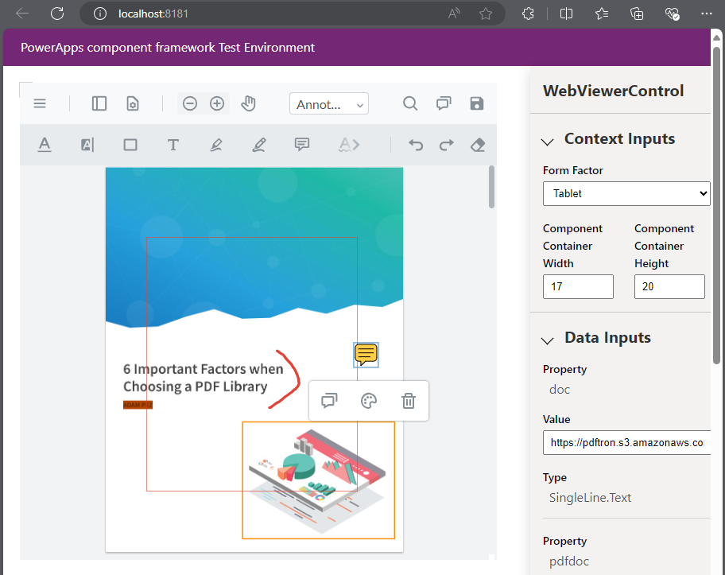

# WebViewer - Powerapps component sample

[WebViewer](https://docs.apryse.com/web/guides/get-started) is a powerful JavaScript-based PDF Library that is part of the [Apryse SDK](https://apryse.com/). It provides a slick out-of-the-box responsive UI that enables you to view, annotate and manipulate PDFs and other document types inside any web project.

- [WebViewer Documentation](https://docs.apryse.com/web/guides/get-started)
- [WebViewer Demo](https://showcase.apryse.com/)

This sample is specifically designed for any users interested in integrating WebViewer into a [Powerapps](https://learn.microsoft.com/en-us/power-apps/maker/canvas-apps/create-component) component project. 

## Get your trial key

A license key is required to run WebViewer. You can obtain a trial key in our [get started guides](https://docs.apryse.com/web/guides/get-started), or by signing-up on our [developer portal](https://dev.apryse.com/).

## Initial setup

Before you begin, make sure your development environment includes:

1. [Node.js](https://nodejs.org/en). Note that WebViewer does not require NodeJS but it is used to help run this sample.
2. IDE used in this sample is Visual Studio Code with NPM commands within its terminal.
3. [GitHub command line](https://github.com/git-guides/install-git) `git`.

## Install

```
git clone --depth=1 https://github.com/ApryseSDK/webviewer-samples.git
cd webviewer-samples/webviewer-powerapps-component
npm install
```

## Run

```
npm start
```

After the app starts, you will be able to see WebViewer running on `localhost:8181` as a control within the PowerApps component framework test environment. This sample requires `localhost:3000` listening in the background. Hence the `npm start` in the `package.json` defines calls to both servers.




Visit Apryse's [WebViewer](https://docs.apryse.com/documentation/web/) page to see what else you can do with the WebViewer.
